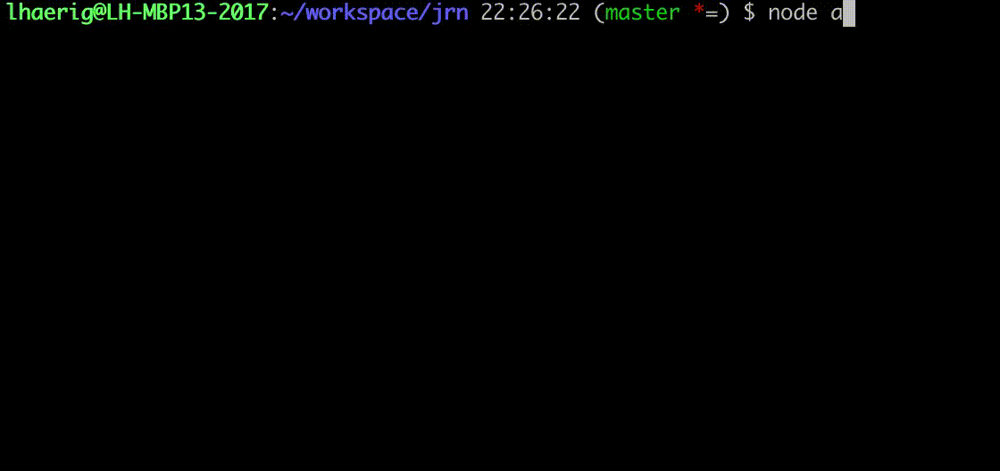

# jrn.js
Node Module to create issues in jira by ease

BETA: jrn is working as expected.
It creates an issue, assigns a sprint and execute an optional post transition. 



## Requirements
* [node](https://nodejs.org/)
* [npm](https://www.npmjs.com/)

## Installation
```bash
npm install;
```

### config 
```bash
# create your custom config
cp config/default.toml.dist config/default.toml;

# modify your local configuration
vim config/default.toml;
```


### create alias
```bash
# add "jrn" as alias to the shell
echo "jrn='~/workspace/jrn/bin/jrn'" >> ~/.bashrc

# Test des Alias
## reload bashrc and call jrn
source ~/.bashrc
jrn
```

## TODOS
* Build + Package to make npm install pebberio/jrn globally possible
* Docker Container
* helper tools, to identify rapidViewId, sprintCustomFieldId, projects and issueTypes
* config wizard
* config verification
* config by env vars
* config by ~/.jrn/config
* config and execution with profiles like aws-cli
* multiple lines for description (vim mode)
* refactoring / cleanup / tweaks


